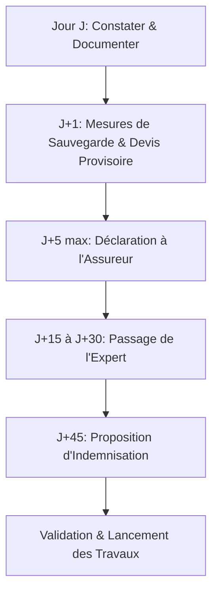

Les conditions météorologiques extrêmes qui frappent régulièrement le département du Gard (épisodes cévenols torrentiels, chutes de grêle géante sur le bassin de Nîmes ou tempêtes de Mistral soufflant à plus de 110 km/h) peuvent causer de graves dommages aux habitations. Lorsque la toiture subit des dégâts matériels importants (tuiles arrachées ou fissurées, infiltrations d'eau massives, effondrement partiel), la gestion du sinistre auprès de l'assurance est une étape critique.

En 2026, les réglementations d'indemnisation et les délais légaux de déclaration ont été optimisés pour protéger les assurés. Voici un guide complet rédigé avec des experts en assurance pour déclarer efficacement votre sinistre toiture dans le Gard et obtenir la meilleure indemnisation pour vos travaux de réparation.

---

## 1. La distinction fondamentale : Garantie Tempête vs Catastrophe Naturelle

Selon l'origine du sinistre et sa violence, votre dossier sera traité sous deux régimes différents :

### La Garantie Tempête (T.O.S - Tempête, Ouragan, Cyclone)
Inclus d'office dans tous les contrats d'assurance Habitation Multirisque (MRH) :
- **Critères :** Concerne les vents violents locaux ayant provoqué des dommages sur des bâtiments environnants ou enregistré une vitesse supérieure à 100 km/h dans la station météo la plus proche (Météo France Courbessac pour Nîmes par exemple).
- **Délai de déclaration :** Vous disposez de **5 jours ouvrés** à compter de la survenance du sinistre pour envoyer votre déclaration.
- **Franchise :** Celle prévue contractuellement dans votre formule MRH (généralement entre 150 € et 300 €).

### Le régime des Catastrophes Naturelles (Cat-Nat)
Nécessite la publication officielle d'un arrêté interministériel au Journal Officiel :
- **Critères :** Épisodes de crues torrentielles, inondations par ruissellement ou mouvements de terrain d'une intensité anormale (très fréquent lors des épisodes cévenols majeurs).
- **Délai de déclaration :** Vous disposez de **30 jours** (délai étendu depuis la loi de 2021) après la publication de l'arrêté au Journal Officiel.
- **Franchise légale :** Fixée par l'État à **380 €** pour les habitations privées. Elle n'est pas négociable, sauf si votre contrat d'assurance applique des conditions plus favorables.

---

## 2. Chronologie pas-à-pas de la gestion d'un sinistre toiture

Pour maximiser vos chances d'indemnisation complète, respectez scrupuleusement les étapes suivantes après la tempête :

### Étape 1 : Constater et documenter (Jour J)
Prenez des photos détaillées de l'extérieur (depuis le sol si possible) des éléments manquants ou brisés. Prenez également des clichés de tous les dégâts intérieurs (peintures écaillées, plafonds tachés, parquets gondolés).
*   *Sécurité d'abord :* Ne montez jamais sur la toiture vous-même pendant que les tuiles sont mouillées ou instables.

### Étape 2 : Mettre en œuvre les mesures de sauvegarde (J+1)
L'assuré a l'obligation légale de limiter l'aggravation des dommages (article L113-1 du Code des Assurances). 
- Contactez un couvreur professionnel qualifié pour effectuer un **bâchage d'urgence** ou une mise hors d'eau provisoire.
- **Conservez les factures :** Les frais de bâchage et de mise en sécurité d'urgence sont pris en charge par l'assureur au titre des mesures de sauvegarde.

### Étape 3 : Déclarer le sinistre à l'assureur (J+5 max)
Envoyez votre déclaration par lettre recommandée avec accusé de réception ou directement via l'espace en ligne de votre assureur. Joignez-y vos photos, une liste des pièces sinistrées, la facture des mesures de sauvegarde d'urgence, et idéalement un **devis détaillé de réfection complète** établi par un couvreur qualifié RGE.

### Étape 4 : L'expertise technique (J+15 à J+30)
Pour tout sinistre important (généralement supérieur à 1 500 € ou 2 000 € de travaux), l'assureur mandate un expert indépendant pour :
- Vérifier la réalité des faits (s'assurer que les dégâts sont bien imputables à l'événement météo déclaré).
- Analyser l'état général de la toiture (déterminer s'il y a un défaut d'entretien ou une vétusté importante préexistante).
- Valider le montant estimé des réparations.

---

## 3. Le piège de la vétusté sur les toitures anciennes

Lors de l'indemnisation d'une toiture en fin de vie, les assureurs appliquent un taux de **vétusté** pour tenir compte de l'usure naturelle des tuiles.

### Comment fonctionne la vétusté ?
Si votre toiture en tuiles canal a 40 ans et est jugée usée à 50 %, l'assureur déduira ces 50 % du remboursement final des matériaux. Par exemple, sur 15 000 € de devis de réfection :
- L'assureur remboursera 7 500 € (la valeur d'usage).
- Les 7 500 € restants sont à la charge du propriétaire (la vétusté).

> [!TIP]
> Vérifiez si votre contrat d'assurance multirisque habitation comporte une option **"Rachat de vétusté"** ou **"Valeur à neuf"**. Ces garanties complémentaires permettent de neutraliser le taux d'usure et de vous faire rembourser 100 % des coûts de reconstruction, à condition que les travaux soient exécutés dans les deux ans suivant le sinistre.
